# **NydusNet 🛡️✨: Secure Reverse Tunnel Manager**

<p align="center">
  <a href="https://github.com/nater0000/nydusnet/releases/latest"></a>
  &nbsp;
  <a href="https://github.com/nater0000/nydusnet/blob/main/LICENSE"></a>
  &nbsp;
  <a href="https://www.python.org/downloads/"></a>
  &nbsp;
  <a href="https://github.com/nater0000/nydusnet/actions"></a>
</p>

NydusNet is a robust, multi-device reverse SSH tunnel management application for Windows. It provides a user-friendly GUI built with **Python** and **CustomTkinter** to securely expose local services to the internet via a remote VPS.

<p align="center">
  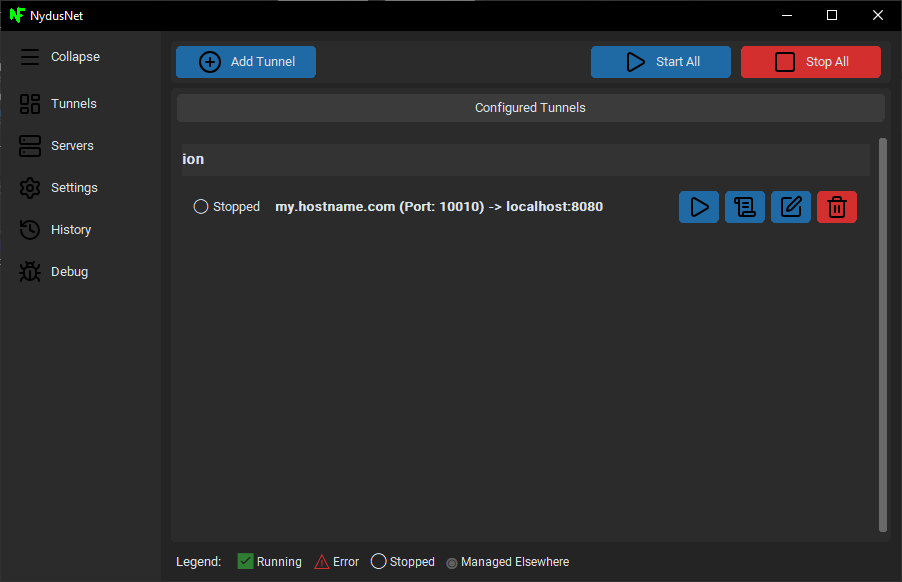
</p>

## **Table of Contents**
* [Core Features](#core-features-)
* [1. Installation](#1-installation)
* [2. First-Time Setup](#2-first-time-setup)
* [3. Server Provisioning](#3-server-provisioning-main-workflow)
* [4. Creating & Managing Tunnels](#4-creating--managing-tunnels)
* [5. Other Features & Settings](#5-other-features--settings)
* [6. Technical Specifications](#6-technical-specifications--architecture-)
* [7. Development Setup](#7-development-environment-setup-)

## **Core Features 🚀**

* **One-Click Server Provisioning**: Automatically configures a fresh Linux server with a secure user, SSH keys, Nginx, Certbot, and a firewall.  
* **Effortless Tunnel Management**: Create, start, stop, edit, and delete tunnels with a clean, intuitive UI.  
* **Multi-Device Sync**: Uses a bundled **Syncthing** instance to automatically and securely sync your encrypted configuration across all your devices.  
* **Real-Time Status & Logs**: Tunnels show their live status (**Connecting**, **Running**, **Error**). View detailed SSH logs directly within the app.  
* **Rock-Solid Security**: All configuration is encrypted at rest with a **master password** and a **recovery key** system.  
* **System Tray Integration**: Runs quietly in the background and can be managed from the system tray.

## **1. Installation**

Download the NydusNet_Installer.exe from the [latest release page](https://github.com/nater0000/nydusnet/releases). Run the installer and follow the setup wizard.

Step 1: Select Destination Location  
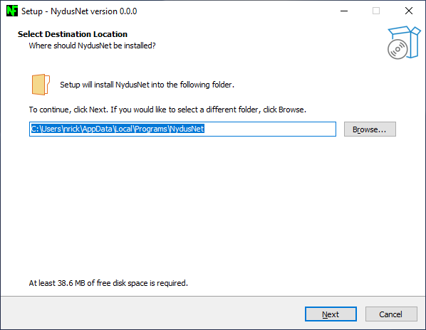

Step 2: Complete the Setup Wizard  
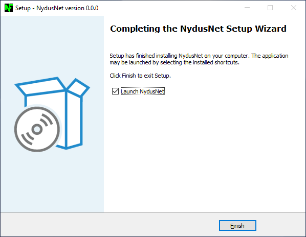

## **2. First-Time Setup**

The first time you launch NydusNet, you'll be guided through a one-time setup process.

Step 1: Welcome Screen  
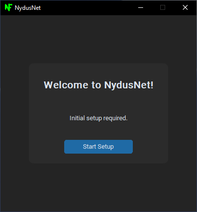

Step 2: Create Master Password  
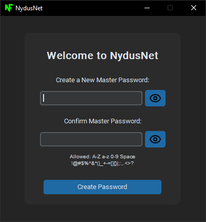

Step 3: Initializing Services  
The app will generate your 2048-bit RSA SSH keys and start the sync service.  
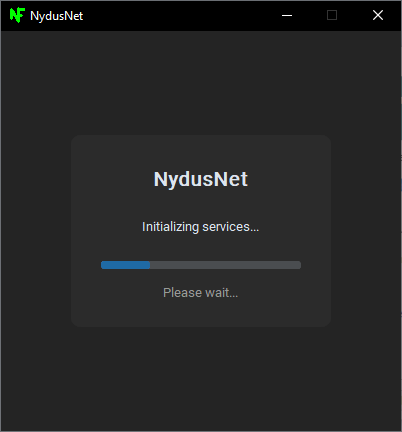

Step 4: Windows Firewall Alert  
During setup, Windows Defender will ask for permission for Syncthing. You must Allow access for multi-device sync to work.  
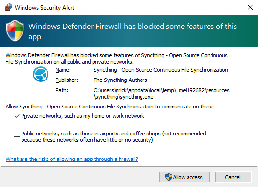

Step 5: Save Your Recovery Key  
This is the only way to recover your data if you forget your master password. Save it somewhere safe!  
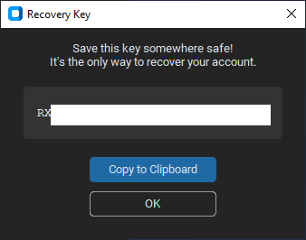

During **Step 3**, NydusNet automatically generates an SSH key pair. These keys are saved to your user profile and automatically loaded into the **Settings -> SSH Keys** tab, ready for server provisioning.

## **3. Server Provisioning (Main Workflow)**

Once setup is complete, you must register and provision a server.

Step 1: Go to the Servers Tab  
Go to the Servers (🖥️ icon) tab. It will be empty.  
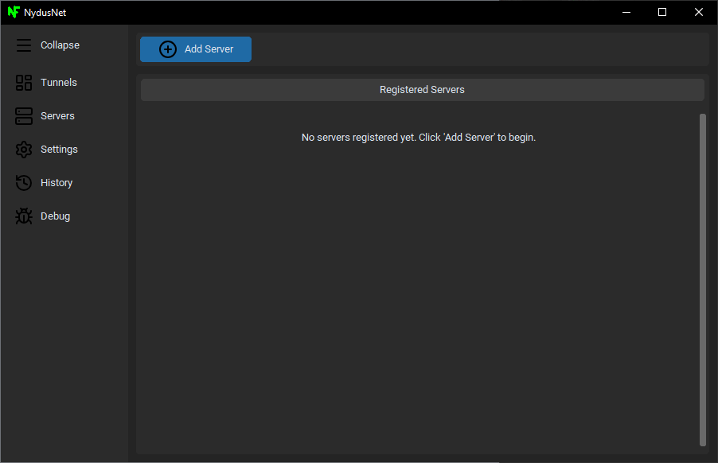

Step 2: Add New Server  
Click "Add New Server". Fill in a Server Name (e.g., "My VPS") and its IP Address / Host. Click Save.  
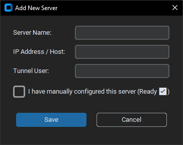

Step 3: Begin Provisioning  
Your server will appear in the list with the status "⚠️ Setup Needed". Click the Wrench (🔧) icon to begin provisioning.  
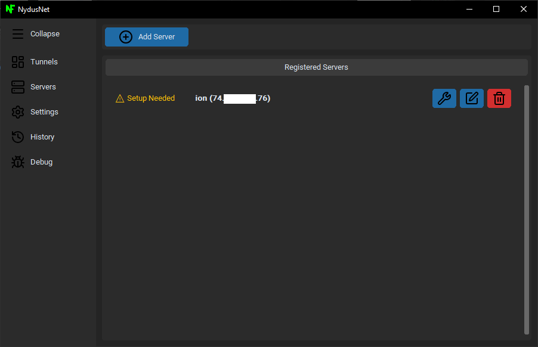

A dialog will ask for the server's **administrative credentials** (e.g., root user and password) and an email for your Let's Encrypt SSL certificates. These are used **one time only** for setup and are **never saved**. The provisioning process will run, and the server's status will change to **"✅ Ready"** when complete.

Note: If provisioning fails with a key error, it may be because an older version of NydusNet failed to generate them, or file permissions are incorrect. You can go to Settings -> SSH Keys to manually set the paths (see Section 5).  
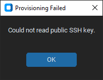

## **4. Creating & Managing Tunnels**

Once your server is "Ready," you can create tunnels.

Step 1: Go to the Tunnels Tab  
Go to the Tunnels (🔀 icon) tab. It will be empty.  
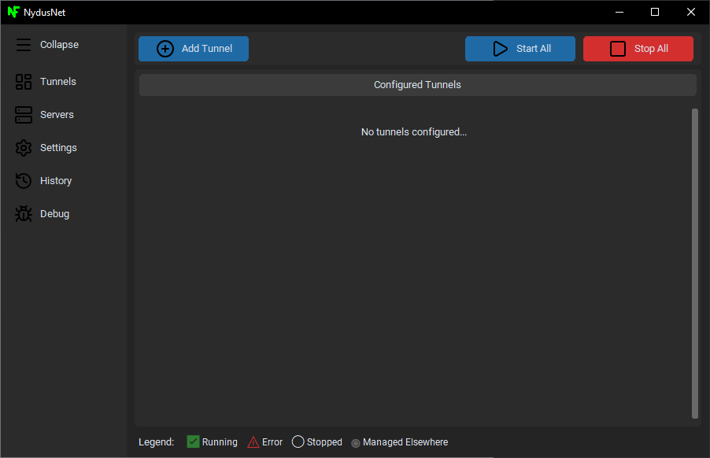

Step 2: Add New Tunnel  
Click "Add Tunnel". Fill in the details for your local service.

* **Hostname:** The public domain you want (e.g., service.mydomain.com)  
* **Server:** Your newly provisioned server.  
* **Remote Port:** The port the public will use (e.g., 443 for HTTPS).  
* **Client Device:** Select "(This Device)".  
* **Local Destination:** Your local service (e.g., 127.0.0.1:8080).

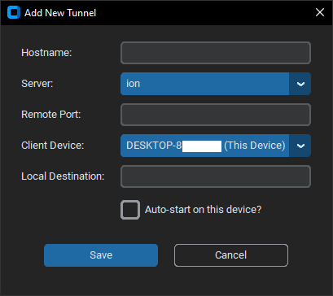  
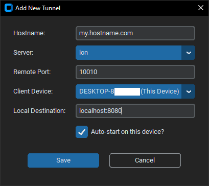

Step 3: Start Your Tunnel  
The new tunnel will appear in your dashboard in the "Stopped" state. Click the Start (▶️) button to activate it.  


Step 4: Manage Your Tunnel  
You can manage the running tunnel using the action buttons:

* **Edit (✏️):** Opens the Edit dialog.  
* **Logs (📄):** Opens the live log viewer for that tunnel.  
* **Delete (🗑️):** Deletes the tunnel.

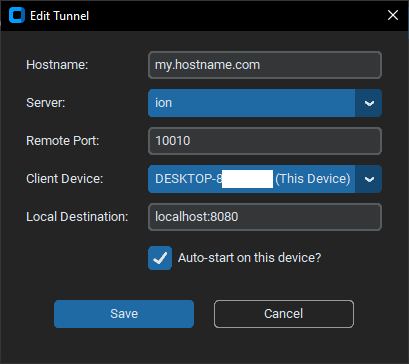  
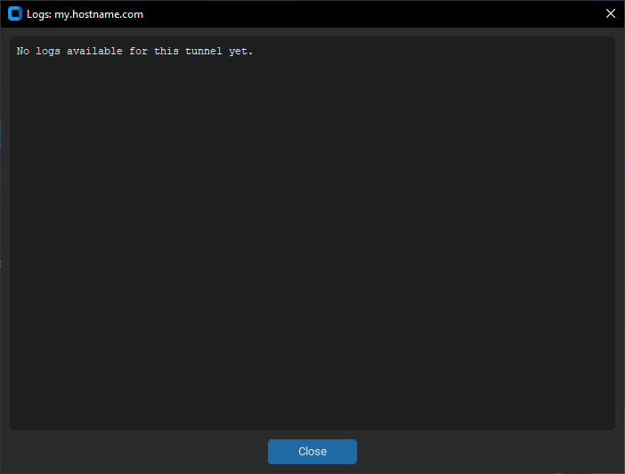

## **5. Other Features & Settings**

NydusNet includes several other views for managing your application.

### **App Management**

Collapsible Sidebar  
Click "Collapse" to get more space.  
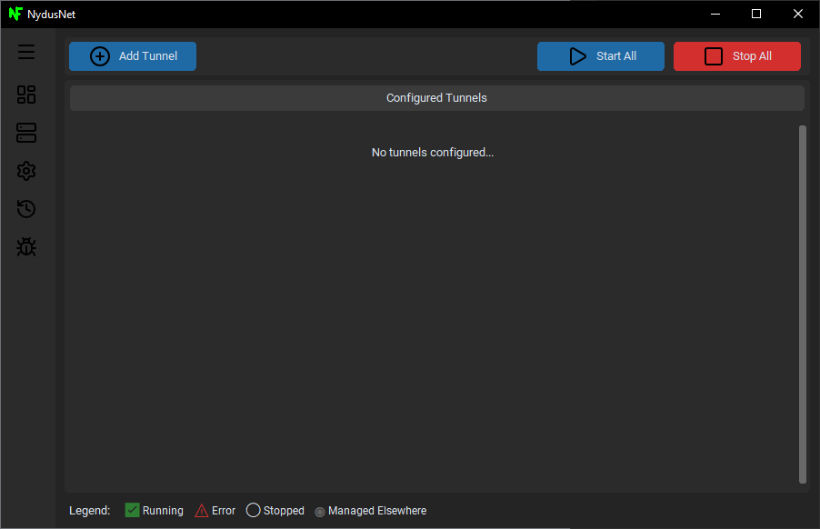

System Tray  
The app runs in the system tray.  
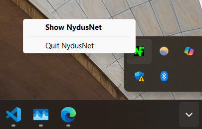

### **Settings Tabs**

Settings -> Devices  
Invite other devices to sync your config.  
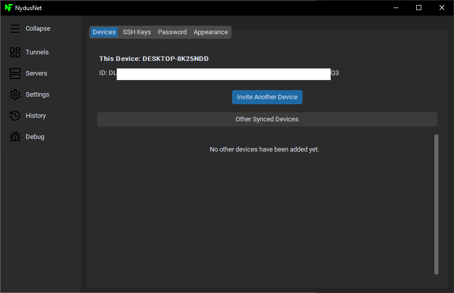

Settings -> SSH Keys (Manual Override)  
NydusNet auto-generates keys, but you can use this tab to manually point to existing keys.  
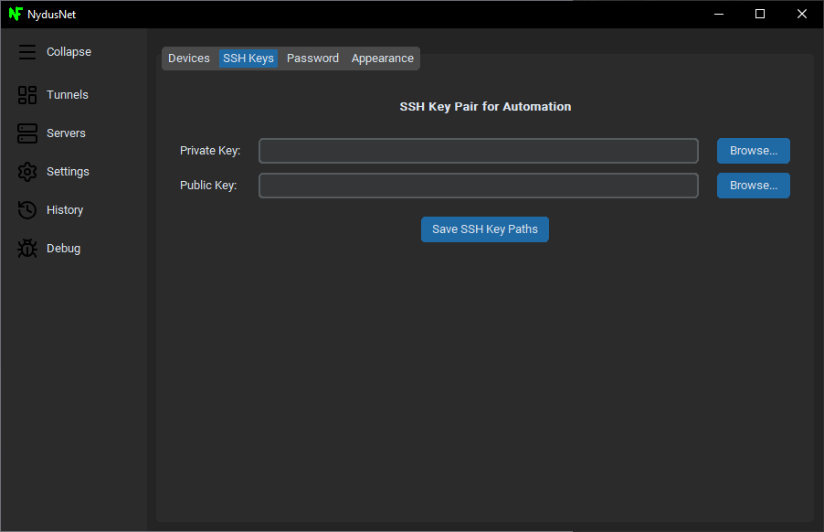

Settings -> Password  
Manage your master password and view your recovery key.  
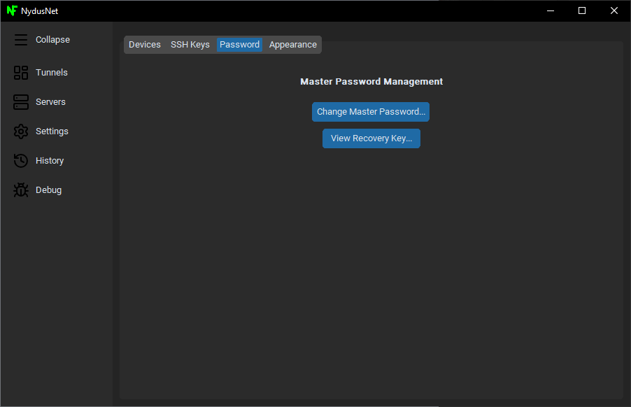

Settings -> Appearance  
Change the app theme.  
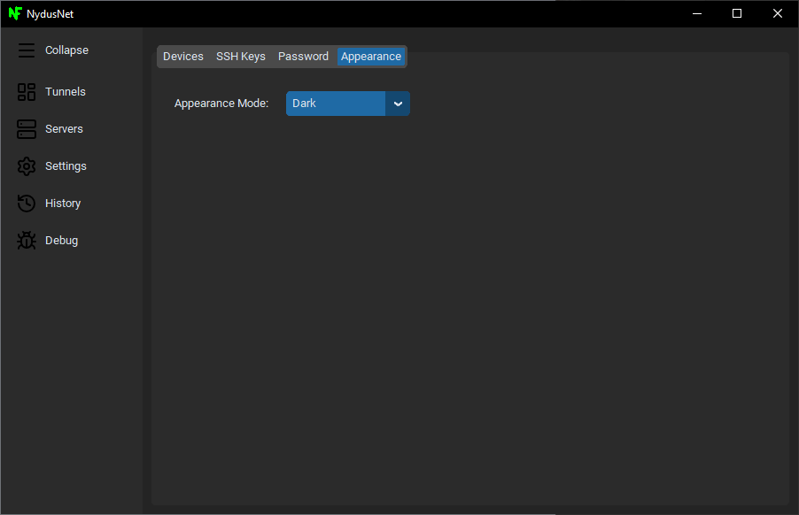

### **History & Debugging**

History View  
Audit all configuration changes over time.  
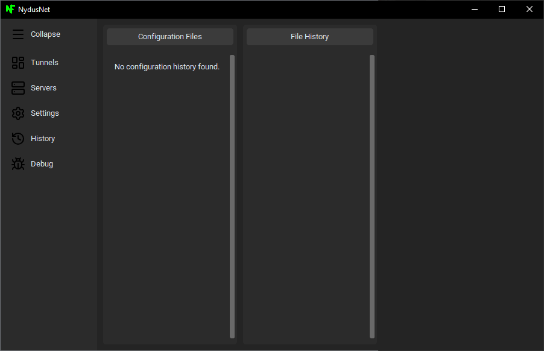

Debug View  
View the raw, in-memory config objects.  
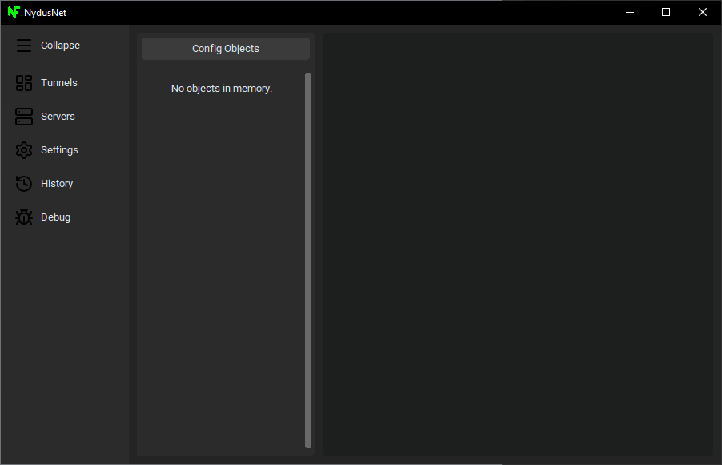

(Note: The Edit Server dialog is also available from the Servers tab.)  
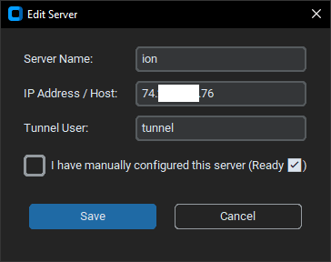

## **6. Technical Specifications & Architecture ⚙️**

NydusNet is architected around a decentralized, encrypted, and auditable configuration system, managed by a set of specialized controllers.

### **6.1 Security and Cryptography (CryptoManager)**

All configuration data is encrypted at rest to maintain confidentiality, integrity, and non-repudiation.

| Component | Specification | Description |
| :---- | :---- | :---- |
| **Data Encryption** | **AES-256 Symmetric Encryption** (via Fernet) | All configuration objects are individually encrypted before being written to disk. |
| **Key Derivation** | **PBKDF2-HMAC-SHA256** | The encryption key is derived from the Master Password using **480,000 iterations** to resist brute-force attacks. |
| **SSH Keys** | **RSA 2048-bit Key Pair** | Automatically generated with public_exponent=65537. Keys are stored securely at %APPDATA%\\NydusNet\\ssh_keys. |
| **Recovery System** | **Encrypted Recovery Key** | Provides a unique, high-entropy key as the sole mechanism for data recovery if the Master Password is lost. |

### **6.2 Tunnel Execution and Control (TunnelManager)**

The TunnelManager manages the lifecycle of the SSH subprocesses on the client device.

* **SSH Client Path**: Execution relies on the native Windows client at **C:\\Windows\\System32\\OpenSSH\\ssh.exe**.  
* **Real-time Logging**: Tunnel output is collected asynchronously into a **collections.deque** structure for memory-efficient, real-time logging, viewable within the app.  
* **Graceful Termination**: Ensures clean resource release by using the **Windows API call ctypes.windll.kernel32.GenerateConsoleCtrlEvent** to send a reliable CTRL_C signal to the SSH process group.

### **6.3 Data Persistence & Synchronization (ConfigManager & SyncthingManager)**

Configuration state is decentralized, version-controlled, and synchronized across devices.

* **Storage Location**: All encrypted data is stored at **%APPDATA%\\NydusNet\\SyncData**.  
* **File Indexing**: The ConfigManager maintains a central **_index.json** file for efficient lookup of all configuration objects (tunnels, servers, devices).  
* **Version History**: Changes are recorded as lightweight **patch files** (e.g., YYYYMMDDTHHMMSS_file_id.patch) generated using the **diff-match-patch** library.  
* **Synchronization**: The application manages an embedded **Syncthing** binary, controlling the P2P sync process via its **REST API**.

### **6.4 Automated Server Provisioning (ServerProvisioner)**

The ServerProvisioner uses **Fabric** to execute secure, idempotent setup on a remote Linux VPS.

* **Services Provisioned**: Installs and configures **OpenSSH**, **Nginx**, **Certbot**, and **UFW**.  
* **Firewall Policy**: UFW is configured to allow inbound traffic only on **TCP/22**, **TCP/80**, and **TCP/443**.  
* **User Isolation**: Creates a dedicated, non-login tunnel user, whose public key is deployed via fabric.Connection's sudo capabilities.  
* **Configuration Templating**: **Jinja2** is used to dynamically generate and deploy Nginx configuration files on the remote server to enable reverse proxy and HTTPS support.

## **7. Development Environment Setup 🧑‍💻**

### **Prerequisites**

* **Python 3.10+** * **Git**

### **Project Setup**

1. **Clone the Repository**:
```
   git clone https://github.com/nater0000/nydusnet.git  
   cd nydusnet
```
2. **Install Dependencies**:
   * The project uses pyproject.toml for dependency management. Install in editable mode:
```
pip install -e .
```
3. **Run the Application**:
```
   python src/main.py
```
4. **Building the Executable**: The build.py script uses **PyInstaller** to package the application, explicitly including resources (resources/syncthing, resources/server-setup, etc.) via the --add-data flag.
```
   python scripts/build.py
```
